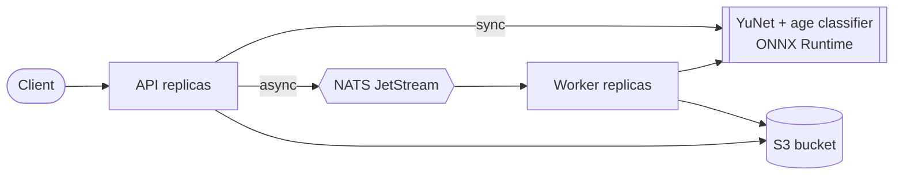

# Age Detection Service

[](https://github.com/chan4kum/opencv-age-detection/actions/workflows/ci.yml)
[](https://github.com/chan4kum/opencv-age-detection/actions/workflows/codeql.yml)
[](LICENSE)


A production-grade, horizontally scalable service that finds faces and estimates their **age group**. It started as a Caffe/OpenCV webcam
script and was rebuilt as a real service: an ONNX pipeline, checksum-pinned models, an honest uncertainty signal, a distributed job queue,
observability, a Helm chart and CI/CD.

> **Read [docs/MODEL_CARD.md](docs/MODEL_CARD.md) first.** This is a coarse, roughly 50%-accurate model (per its authors' own benchmark) whose weights
> have **no explicit open-source license**. It is not suitable for age verification or any decision about a person.

* **Pipeline:** YuNet face detection, then a Levi & Hassner GoogleNet age-group classifier on each crop, over up to five views (crop scales and a mirror), aggregated.
* **Honest output:** an age *group* (0-2 ... 60-100), the probability per group, `agreement` between views and an `uncertain` flag. Never a fake exact age.
* **Why multi-view:** the network's own probabilities are saturated (1.00 on a clean crop, 0.99 for a *different* group after a mild blur), so they cannot signal doubt. View agreement can.
* **Distributed and cloud-agnostic:** stateless API + workers over **NATS JetStream**, images in any **S3-compatible** store, Docker/Kubernetes, Prometheus/Grafana, OpenTelemetry.
* **Secure by default:** hashed API keys, strict input validation, non-root read-only container, network policies, checksum-pinned models.



## Quick start

```bash
make models                                  # download + verify the age weights (they are not stored in git)
docker compose --profile observability up -d --build --wait

curl -s -X POST localhost:8000/v1/estimate -H 'Content-Type: image/jpeg' \
     --data-binary @tests/data/two_faces.jpg | jq '.faces[].age'

curl -s -X POST localhost:8000/v1/estimate/annotated -H 'Content-Type: image/jpeg' \
     --data-binary @tests/data/astronaut.jpg -o annotated.jpg      # labels; orange "?" = uncertain

ID=$(curl -s -X POST localhost:8000/v1/jobs -H 'Content-Type: image/jpeg' --data-binary @tests/data/two_faces.jpg | jq -r .job_id)
curl -s localhost:8000/v1/jobs/$ID | jq
```

### CLI / library (no servers)

```bash
make models && uv sync
uv run age-detection estimate photo.jpg -o annotated.jpg     # JSON on stdout
uv run age-detection webcam                                   # live demo (needs GUI OpenCV)
uv run age-detection verify-models
```

```python
import cv2
from pathlib import Path
from age_detection.age import AgeClassifier
from age_detection.config import DEFAULT_AGE_MODEL_SHA256, DEFAULT_MODEL_SHA256
from age_detection.detector import YuNetDetector

detector = YuNetDetector(Path("models/face_detection_yunet_2026may.onnx"), expected_sha256=DEFAULT_MODEL_SHA256)
classifier = AgeClassifier(Path("models/age_googlenet.onnx"), expected_sha256=DEFAULT_AGE_MODEL_SHA256)
image = cv2.imread("photo.jpg")
for face in detector.detect(image):
    est = classifier.classify_face(image, (face.x, face.y, face.width, face.height))
    print(est.group, est.confidence, est.agreement, "uncertain" if est.uncertain else "")
```

> The webcam demo needs GUI OpenCV: `uv pip uninstall opencv-python-headless && uv pip install opencv-python`.

## API

| Endpoint | Description |
|---|---|
| `POST /v1/estimate` | Body = raw image bytes (`image/jpeg`, `png`, `webp`, `bmp`). Returns each face's box, landmarks and `age`. |
| `POST /v1/estimate/annotated` | Same input; returns a JPEG with boxes and age-group labels (`X-Face-Count` header). |
| `POST /v1/jobs`, `GET /v1/jobs/{id}` | Asynchronous estimation; only the submitting API key can read a job. |
| `GET /v1/models`, `/healthz`, `/readyz`, `/metrics` | Model metadata and checksums; liveness; readiness (models, NATS, object storage); Prometheus. |

Errors are [RFC 9457](https://www.rfc-editor.org/rfc/rfc9457) `application/problem+json` with a `request_id`. Auth: `Authorization: Bearer <key>` (`age-detection keygen`).

<details><summary>Example response (one face)</summary>

```json
{
  "image": {"width": 512, "height": 512},
  "faces": [{
    "box": {"x": 178.0, "y": 63.0, "width": 90.0, "height": 113.0}, "score": 0.937,
    "landmarks": {"right_eye": {"x": 205.4, "y": 107.3}, "...": "..."},
    "age": {
      "group": "25-32", "age_low": 25, "age_high": 32,
      "confidence": 1.0, "agreement": 1.0, "views": 5, "uncertain": false,
      "probabilities": {"0-2": 0.0, "4-6": 0.0, "8-12": 0.0, "15-20": 0.0, "25-32": 1.0, "38-43": 0.0, "48-53": 0.0, "60-100": 0.0}
    }
  }],
  "inference_ms": 214.6,
  "models": {"face_detector": {"name": "yunet-2026may", "...": "..."}, "age_classifier": {"name": "levi-hassner-googlenet-adience", "...": "..."}, "age_views": 5},
  "request_id": "9b1d..."
}
```

Note the probabilities above are what the network really outputs on a clean portrait: saturated. Trust `agreement` / `uncertain`, not a single probability.
</details>

## Configuration

Environment variables prefixed `AD_`, validated at start-up. The important ones:

| Variable | Default | Purpose |
|---|---|---|
| `AD_ENVIRONMENT` | `dev` | `prod` requires `AD_API_KEY_HASHES` (or an explicit `AD_AUTH_DISABLED=true`) |
| `AD_AGE_VIEWS` | `5` | Views per face (1-5). 1 is fastest but removes the uncertainty signal |
| `AD_AGE_MIN_CONFIDENCE` | `0.6` | Below this a face is flagged `uncertain` (3 of 5 views must agree) |
| `AD_MAX_FACES` | `20` | Faces analysed per image (each costs up to about 5 x 43 ms on one thread) |
| `AD_ORT_INTRA_OP_THREADS`, `AD_MAX_CONCURRENT_INFERENCE` | `1`, `4` | Threads per estimation and concurrent estimations (see the table below) |
| `AD_SCORE_THRESHOLD`, `AD_MAX_UPLOAD_BYTES`, `AD_MAX_IMAGE_PIXELS` | `0.7`, 10 MiB, 40 MP | Face threshold and request limits |
| `AD_ASYNC_ENABLED`, `AD_NATS_URL`, `AD_S3_*` | see `config.py` | Async pipeline backing services |

Complete reference: [`src/age_detection/config.py`](src/age_detection/config.py).

## Deploy

Docker Compose (above); Kubernetes via the Helm chart in [`deploy/helm/age-detection`](deploy/helm/age-detection); guide, production checklist and AWS mapping in [docs/DEPLOYMENT.md](docs/DEPLOYMENT.md).
**Container images are not published automatically** (the age weights have no explicit license): set the repository variable `PUBLISH_IMAGE=true` to enable the release workflow after reading the model card.

## Measured behaviour

One API container in a Linux VM on an Apple M4 Pro (Docker Desktop), one face in a 512x512 image, real models (reproduce with `make bench`):

| ONNX threads per estimation | Views | Concurrent slots | Latency p50 (1 client) | Throughput (16 clients) |
|---|---|---|---|---|
| 1 | 5 (default) | 4 | 214.5 ms | 18.4 req/s |
| 4 | 5 | 4 | 71.1 ms | 29.0 req/s |
| 1 | 3 | 4 | 136.2 ms | 29.6 req/s |
| 1 | 1 | 4 | 56.9 ms | 72.5 req/s |
| 4 | 1 | 4 | 22.4 ms | 99.8 req/s |
| 1 | 5 | 8 | 213.6 ms | 32.7 req/s |

Latency is dominated by the number of views (about 43 ms per view per thread). More threads cut single-request latency; more slots and pods raise throughput.
Budget roughly one CPU core per active estimation. Memory was 271 MiB after load. Numbers are for this hardware; benchmark yours.

## Verification status

| Area | How it was verified | Result |
|---|---|---|
| Unit + integration tests | Real models; real NATS JetStream + SeaweedFS S3 for the async path | 142 passed, 95% combined coverage (gate: 90%) |
| Classifier | Crop geometry (edge padding, centring), preprocessing, softmax stability, aggregation math, determinism, integrity checks | passes |
| Uncertainty signal | Blurred copies of one face: single view stays at 0.99 confidence; 5-view agreement fell to 0.4 and flagged the strongest blur | works as designed (heuristic, see model card) |
| Container | Built with checksum-verified weights; run non-root / read-only / no capabilities | works |
| Kubernetes (kind) | Chart install, `helm test`, auth (401/401/200), real-model estimation, async job; 30 jobs queued while workers were parked, NATS restarted, workers restored | 30/30 succeeded, none lost |
| Helm chart | `helm lint --strict`; every emitted `AD_*` variable is a real setting (test) | passes |

**Not verified:** accuracy on labelled data (none is bundled; see the model card for the authors' reported numbers), fairness across demographic groups, calibration of `confidence`,
KEDA / prometheus-operator resources, NetworkPolicy enforcement on your CNI, multi-arch image build and signing (release workflow only, and disabled by default).

## Development

```bash
make models && uv sync --all-groups && uv run pre-commit install
make lint        # ruff, ruff format, mypy --strict
make test        # unit tests (fetches the age weights if missing)
make up && make test-integration
```

See [CONTRIBUTING.md](CONTRIBUTING.md), [docs/RUNBOOK.md](docs/RUNBOOK.md), [SECURITY.md](SECURITY.md), [docs/adr](docs/adr).

## License

MIT for this repository's code. The bundled YuNet face detector is MIT (see `models/YUNET_README.md`). **The age classifier weights are not part of this repository and carry no explicit open-source license:** see [docs/MODEL_CARD.md](docs/MODEL_CARD.md).
